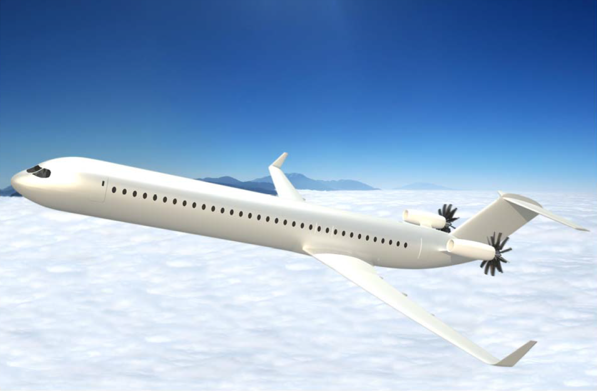
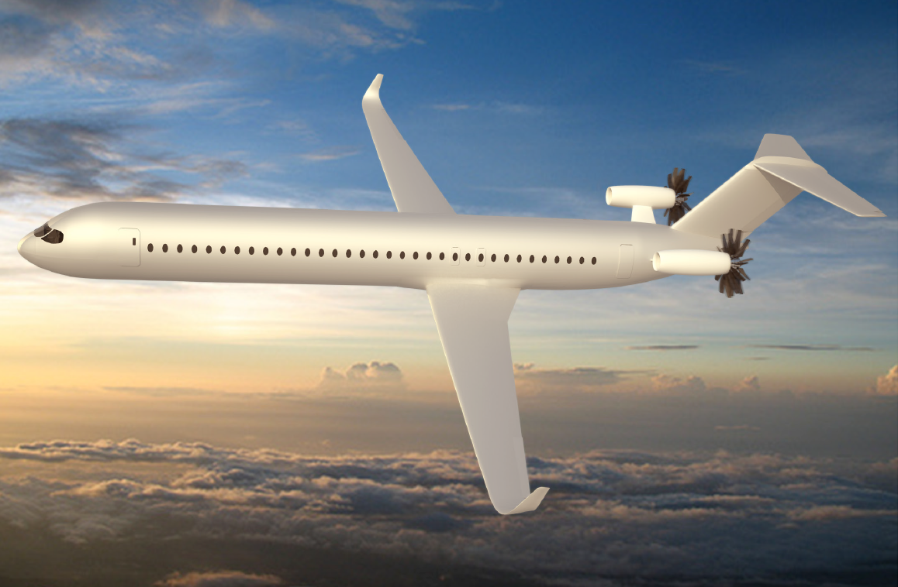
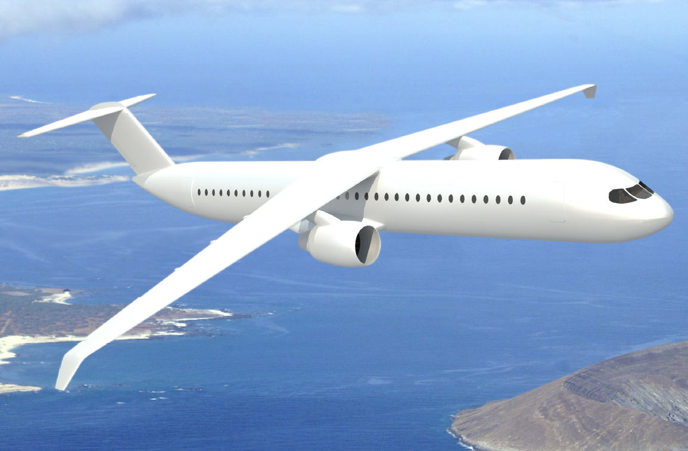
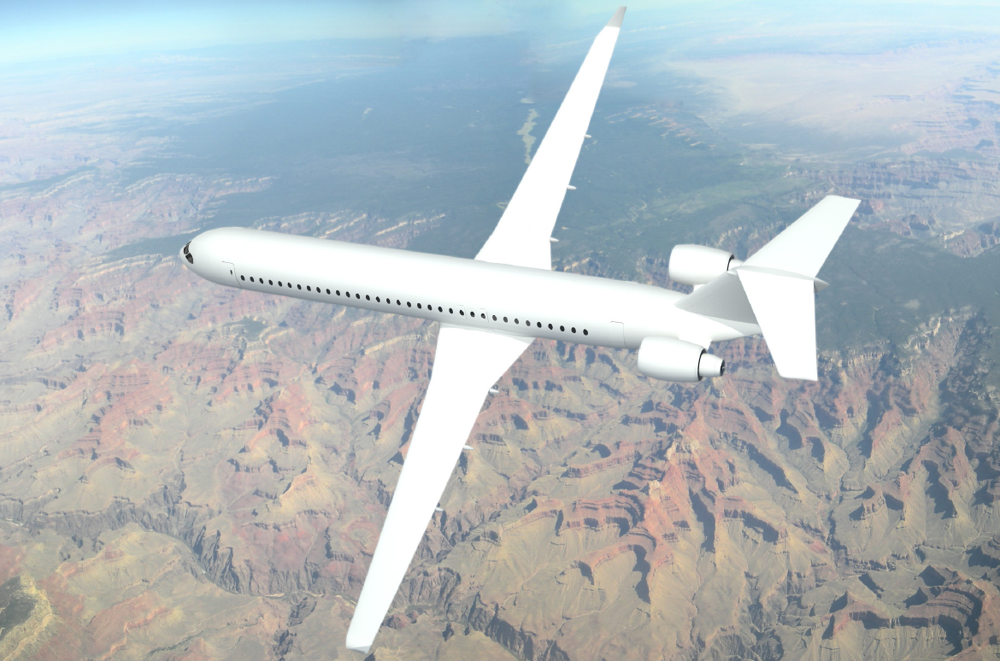
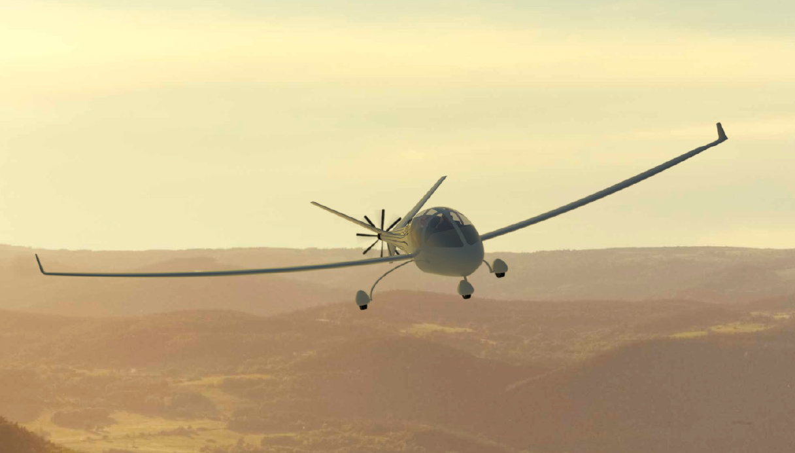
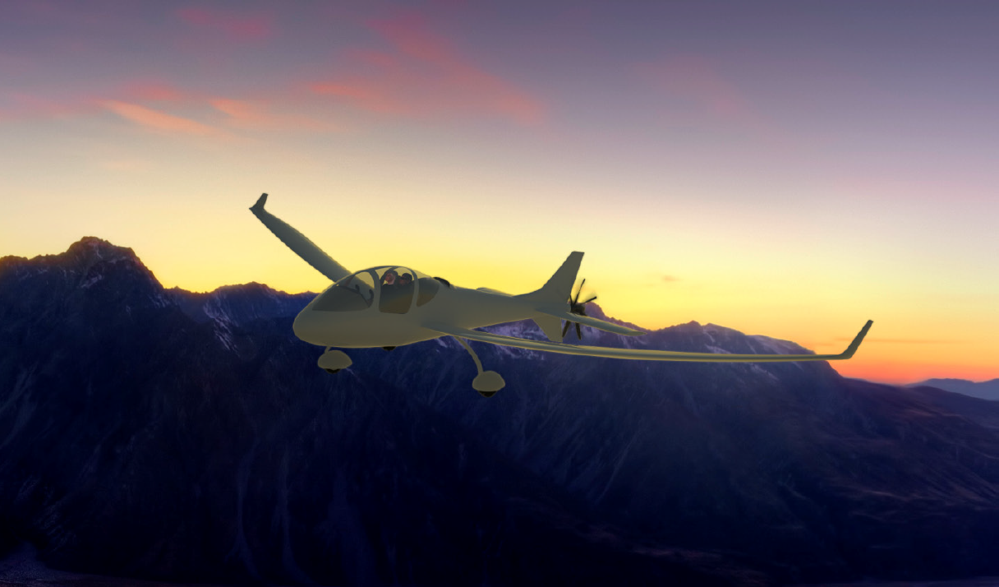
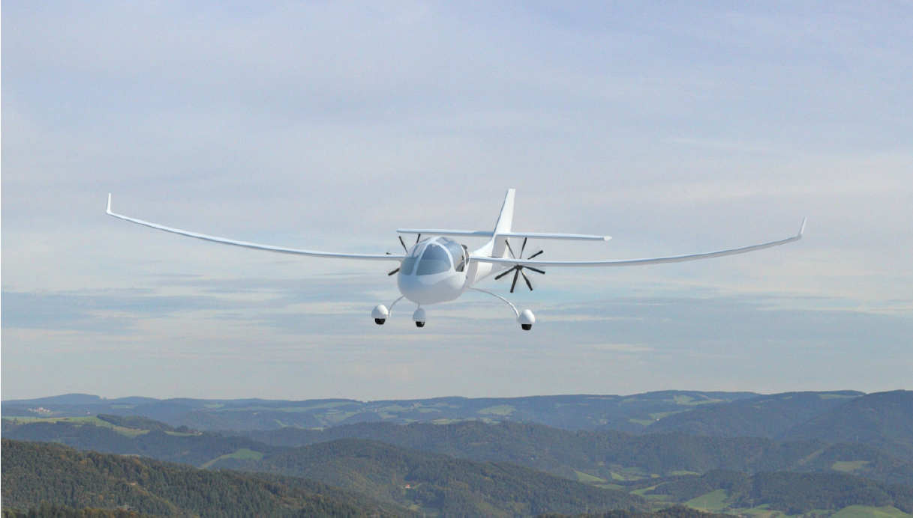
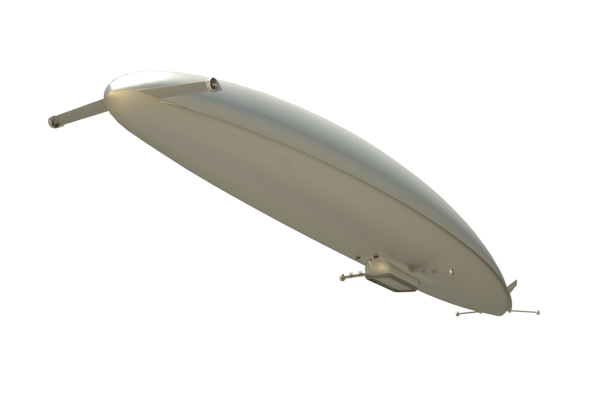

## Contents
* [About Me](#about-me)
* [Websites](#websites)
* [Java And Android Public Repositories](#java-and-android-public-repositories)
* [C++ Public Repositories](#c-public-repositories)
* [Patents](#patents)
* [Other Resume Links](#other-resume-links)

## About Me

I am currently a Software Development Engineer at Amazon, formerly a Propulsion Engineer at Boeing. I started my career at Boeing following my passion for the physical sciences. However, I have always been interested in computer science, and after 8 years at Boeing, I decided to make a career change. I decided to return to school to get a Master's in computer science, after which I started my computer science career at Amazon's MCF. I am currently enjoying the opportunity this work provides him to help businesses, both big and small, succeed - at the scale of Amazon.

* <a href="Resume Todd Erickson.pdf" target="_blank">Resume (pdf)</a>
* [LinkedIn](https://www.linkedin.com/in/todd-w-erickson/)

## Patents
* System and method for augmenting a primary powerplant - Pending - [US 20180118364A1](https://patents.google.com/patent/US20180118364A1/en)
* Fire-retarding artillery shell - Granted - [US 10429160B2](https://patents.google.com/patent/US10429160B2/en)
* Laterally reinforced variable pitch rotor - Granted - [US 10018058B2](https://patents.google.com/patent/US10018058B2/en)
* Systems and methods for determining sizes and shapes of geodesic modules - Granted - [US 9965582B2](https://patents.google.com/patent/US9965582B2/en)
* Systems and methods for manufacturing a tubular structure - Granted - [US 9957031B2](https://patents.google.com/patent/US9957031B2/en)
* Integrated pusher turbofan for aircraft - Granted - [US 9950800B2](https://patents.google.com/patent/US9950800B2/en)
* Contra-rotating open fan propulsion system - Granted - [US 9835093B2](https://patents.google.com/patent/US9835093B2/en)
* Vibration dampening for horizontal stabilizers - Granted - [US 9828084B2](https://patents.google.com/patent/US9828084B2/en)
* Fire-retarding artillery shell - Granted - [US 9816791B2](https://patents.google.com/patent/US9816791B2)
* Geodesic structure forming systems and methods - Granted - [US 9789548B2](https://patents.google.com/patent/US9789548B2)

## Java and Android Public Repositories

### Personal Projects
* [https://github.com/terickson87/IsWeatherGoodForAWalk_BottomNav_Andriod](https://github.com/terickson87/IsWeatherGoodForAWalk_BottomNav_Andriod)
* [https://github.com/terickson87/IsWeatherGoodForAWalk_Android](https://github.com/terickson87/IsWeatherGoodForAWalk_Android)
* [https://github.com/terickson87/MVVM](https://github.com/terickson87/MVVM)
* [https://github.com/terickson87/build_your_first_app](https://github.com/terickson87/build_your_first_app)
* [https://github.com/terickson87/first_android_app](https://github.com/terickson87/first_android_app)
* [https://github.com/terickson87/Android_Hello_World](https://github.com/terickson87/Android_Hello_World)

## C++ Public Repositories

### Personal Projects
* [https://github.com/terickson87/CPlusPlusStarter](https://github.com/terickson87/CPlusPlusStarter)
* [https://github.com/terickson87/CustomThrow](https://github.com/terickson87/CustomThrow)
* [https://github.com/terickson87/HackerRank](https://github.com/terickson87/HackerRank)
* [https://github.com/terickson87/SamsTeachYourself](https://github.com/terickson87/SamsTeachYourself)

## Other Resume Links

### Course Links
* [CSCI 510 - Software Management and Economics](https://classes.usc.edu/term-20203/course/csci-510/)
* [CSCI 530 - Security Systems](https://classes.usc.edu/term-20203/course/csci-530/)
* [CSCI 530 - Archived Fall 2019 Course Website](https://web.archive.org/web/20200702170703/http:/csclass.info/USC/CSCI530/F19/)
* [Wikipedia - COCOMO](https://en.wikipedia.org/wiki/COCOMO)
* [Wikipedia - Unified Code Count (UCC)](https://en.wikipedia.org/wiki/Unified_Code_Count_(UCC))
* [The MNIST database of handwritten digits](http://yann.lecun.com/exdb/mnist/)
* [Weenix Operating System](https://github.com/brown-cs1690/handout/wiki)

### Adcademic Awards
* [AIAA Undergraduate Team Aircraft Design Competition - News](https://viterbi.usc.edu/news/news/2010/viterbi-student-team.htm)
* [AIAA Undergraduate Team Aircraft Design Competition - Paper](https://issuu.com/sina_golshany/docs/aiaa_team_aircraft_design_paper_for)
* [AIAA Undergraduate Team Aircraft Design Competition - Conference Presentation](https://issuu.com/sina_golshany/docs/egret_presentationpdf)
* [DEN@Viterbi Scholarship](https://viterbigradadmission.usc.edu/denviterbi-scholarship/)

### Academic Projects

#### 737 Replacement
<table>
  <th style="text-align:center">Albatross</th>
  <th style="text-align:center">Egret</th>
  <th style="text-align:center">Ibis</th>
  <th style="text-align:center">Levant</th>
  <th style="text-align:center">Waxwing</th>
  <tr>
    <td style="text-align:center"></td>
    <td style="text-align:center"></td>
    <td style="text-align:center"></td>
    <td style="text-align:center"></td>
    <td style="text-align:center"></td>
  </tr>
</table>

#### All Electric Light Sport Aircraft (LSA)
<table>
  <th style="text-align:center">Dragonfly</th>
  <th style="text-align:center">Honey Badger</th>
  <th style="text-align:center">Pandion</th>
  <th style="text-align:center">Azalzan</th>
  <tr>
    <td style="text-align:center"></td>
    <td style="text-align:center"></td>
    <td style="text-align:center"></td>
    <td style="text-align:center"></td>
  </tr>
</table>

#### Hybrid Airship
<table>
  <th style="text-align:center">ORCA</th>
  <tr>
    <td style="text-align:center"></td>
  </tr>
</table>

