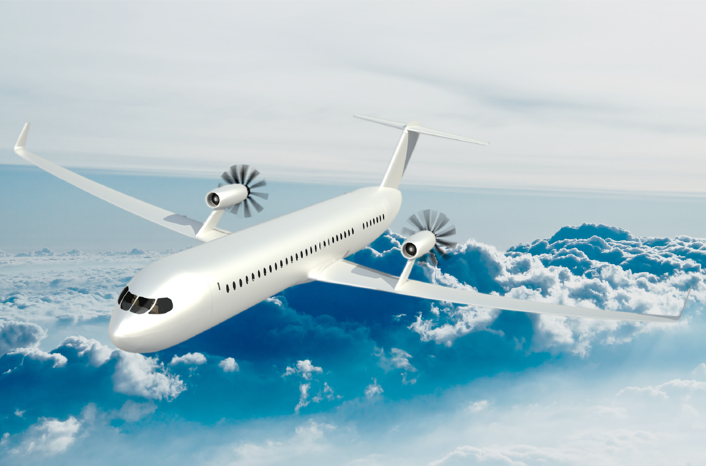

## Contents
* [About Me](#about-me)
* [Patents](#patents)
* [Other Resume Links](#other-resume-links)

## About Me

Todd is a Software Development Engineer at Amazon, where he works on the Multi-Channel Fulfillment service that enables businesses of all sizes to leverage Amazon's fulfillment network. He has master's degrees in both Computer Science and Aerospace Engineering from the University of Southern California and a background in aerospace engineering at Boeing.

With 3 years of experience at Amazon, Todd has designed, developed, and maintained software using Java, Kotlin, TypeScript, Python, AWS cloud services, and the AWS CDK. He has created a React website for the supplychain.amazon.com order management dashboard, and a fulfillment client for eCommerce platforms, including Shopify. Todd enjoys the opportunity to work with cutting-edge technologies and solve complex problems that help customers succeed at the scale of Amazon.

* <a href="Resume Todd Erickson.pdf" target="_blank">Resume (pdf)</a>
* [LinkedIn](https://www.linkedin.com/in/todd-w-erickson/)
* [My Github home](https://github.com/terickson87)
* [My Github repositories](https://github.com/terickson87?tab=repositories)

## Patents
* System and method for augmenting a primary powerplant - Pending - [US 20180118364A1](https://patents.google.com/patent/US20180118364A1/en)
* Fire-retarding artillery shell - Granted - [US 10429160B2](https://patents.google.com/patent/US10429160B2/en)
* Laterally reinforced variable pitch rotor - Granted - [US 10018058B2](https://patents.google.com/patent/US10018058B2/en)
* Systems and methods for determining sizes and shapes of geodesic modules - Granted - [US 9965582B2](https://patents.google.com/patent/US9965582B2/en)
* Systems and methods for manufacturing a tubular structure - Granted - [US 9957031B2](https://patents.google.com/patent/US9957031B2/en)
* Integrated pusher turbofan for aircraft - Granted - [US 9950800B2](https://patents.google.com/patent/US9950800B2/en)
* Contra-rotating open fan propulsion system - Granted - [US 9835093B2](https://patents.google.com/patent/US9835093B2/en)
* Vibration dampening for horizontal stabilizers - Granted - [US 9828084B2](https://patents.google.com/patent/US9828084B2/en)
* Fire-retarding artillery shell - Granted - [US 9816791B2](https://patents.google.com/patent/US9816791B2)
* Geodesic structure forming systems and methods - Granted - [US 9789548B2](https://patents.google.com/patent/US9789548B2)

## Other Resume Links

### Course Links
* [CSCI 510 - Software Management and Economics](https://classes.usc.edu/term-20203/course/csci-510/)
* [CSCI 530 - Security Systems](https://classes.usc.edu/term-20203/course/csci-530/)
* [CSCI 530 - Archived Fall 2019 Course Website](https://web.archive.org/web/20200702170703/http:/csclass.info/USC/CSCI530/F19/)
* [Wikipedia - COCOMO](https://en.wikipedia.org/wiki/COCOMO)
* [Wikipedia - Unified Code Count (UCC)](https://en.wikipedia.org/wiki/Unified_Code_Count_(UCC))
* [The MNIST database of handwritten digits](http://yann.lecun.com/exdb/mnist/)
* [Weenix Operating System](https://github.com/brown-cs1690/handout/wiki)

### Adcademic Awards
* [AIAA Undergraduate Team Aircraft Design Competition - News](https://viterbi.usc.edu/news/news/2010/viterbi-student-team.htm)
* [AIAA Undergraduate Team Aircraft Design Competition - Paper](https://issuu.com/sina_golshany/docs/aiaa_team_aircraft_design_paper_for)
* [AIAA Undergraduate Team Aircraft Design Competition - Conference Presentation](https://issuu.com/sina_golshany/docs/egret_presentationpdf)
* [DEN@Viterbi Scholarship](https://viterbigradadmission.usc.edu/denviterbi-scholarship/)

### Academic Projects

#### 737 Replacement
<table>
  <th style="text-align:center">Albatross</th>
  <th style="text-align:center">Egret</th>
  <th style="text-align:center">Ibis</th>
  <th style="text-align:center">Levant</th>
  <th style="text-align:center">Waxwing</th>
  <tr>
    <td style="text-align:center"></td>
    <td style="text-align:center"></td>
    <td style="text-align:center"></td>
    <td style="text-align:center"></td>
    <td style="text-align:center"></td>
  </tr>
</table>

#### All Electric Light Sport Aircraft (LSA)
<table>
  <th style="text-align:center">Dragonfly</th>
  <th style="text-align:center">Honey Badger</th>
  <th style="text-align:center">Pandion</th>
  <th style="text-align:center">Azalzan</th>
  <tr>
    <td style="text-align:center"></td>
    <td style="text-align:center"></td>
    <td style="text-align:center"></td>
    <td style="text-align:center"></td>
  </tr>
</table>

#### Hybrid Airship
<table>
  <th style="text-align:center">ORCA</th>
  <tr>
    <td style="text-align:center"></td>
  </tr>
</table>

